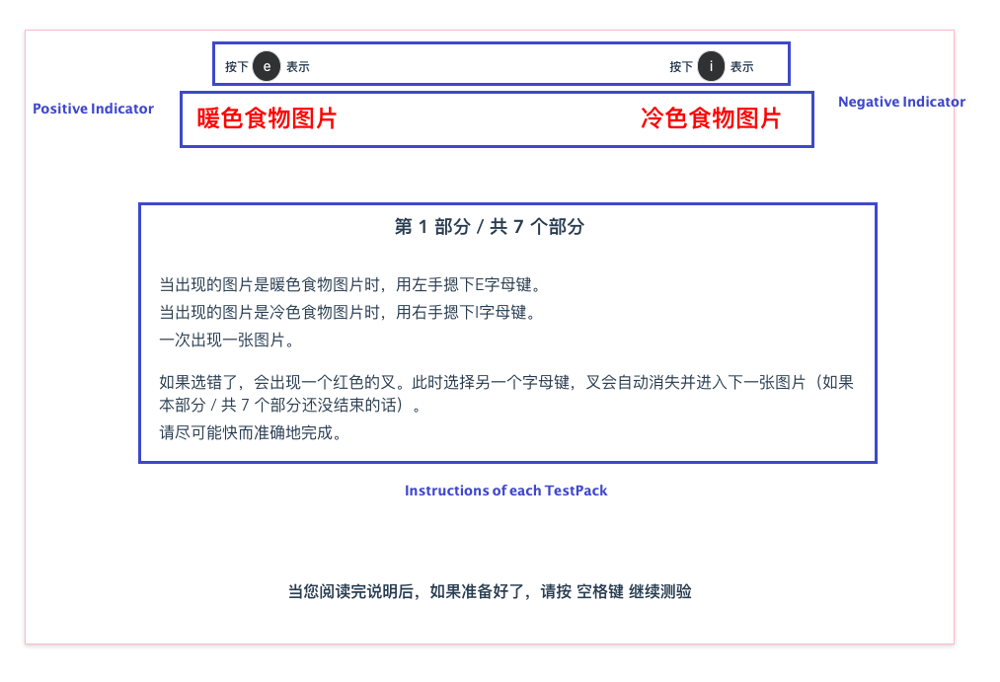
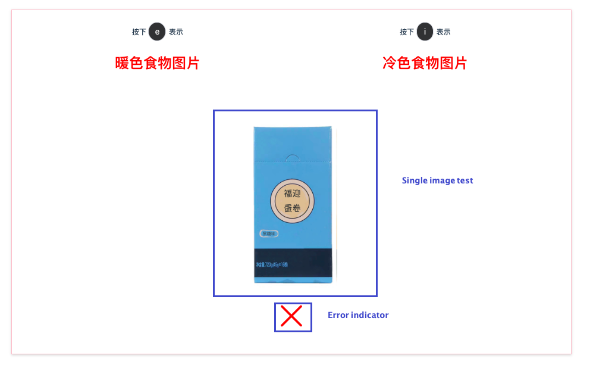
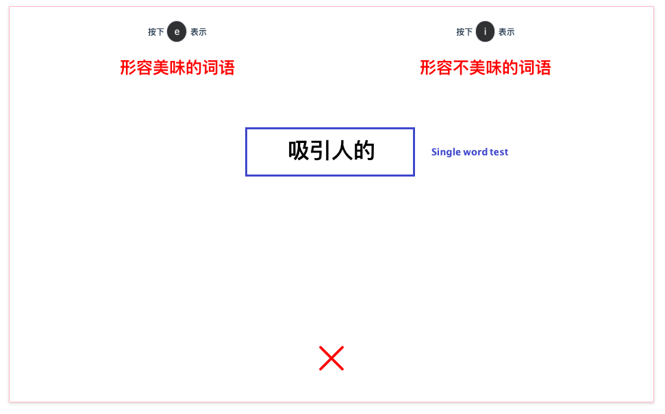
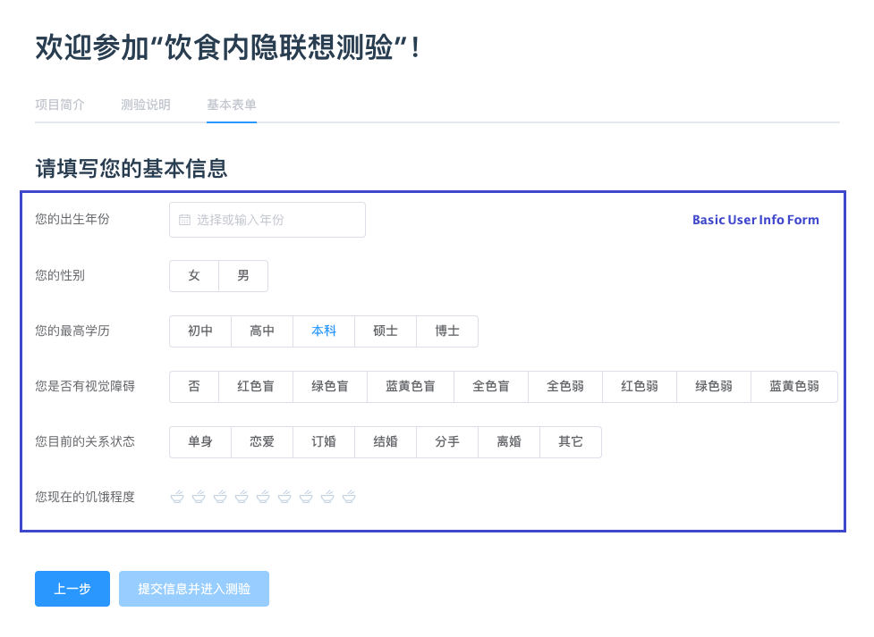
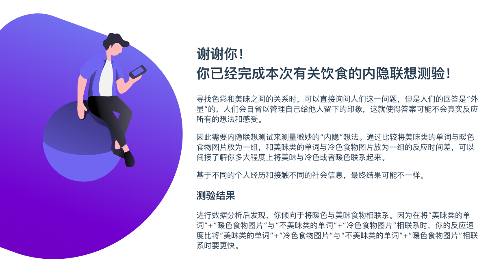

# IAT: Implicit Association Test

[](https://app.netlify.com/sites/zen-noyce-477e24/deploys)

A project for Implicit Association Test, SPA + Serverless backend.

## Introduction

[Implicit Association Test](https://en.wikipedia.org/wiki/Implicit-association_test):

> The implicit-association test (IAT) is a measure within social psychology designed to detect the strength of a person's subconscious association between mental representations of objects (concepts) in memory. It is commonly applied to assess implicit stereotypes held by test subjects, such as unconsciously associating stereotypically black names with words consistent with black stereotypes. The test's format is highly versatile, and has been used to investigate biases in racial groups, gender, sexuality, age, and religion, as well as assessing self-esteem.

This IAT is inspired by [Project Implicit](https://implicit.harvard.edu/).

## Features

- Super fast for deployment and development
- Extensible
  - add any number of tests
- Reliable
  - image preloading
  - user action log
  - user leave confirmation
  - time sensitive
  - minimum interference

## Development

### Serverless

This project uses Tencent cloud function (aka. Tencent SCF), the main logic is defined in `/serverless/iat/main.py`.

### SPA

This project basically uses Vue + Typescript + Element-UI.

## Start Up 🎈

A mock server is needed to run the SPA without backend. Besides, `npm` and `Node.js` is required, this project is also `yarn` compatible.

This project use `json-server` as a mock API server. To run the SPA, follow the instructions below:

- Install `Node.js` and `npm` [Click here to know `How to install Node.js and npm?`](https://www.google.com/search?q=how+to+install+nodejs+and+npm)
- Install `json-server` by running command: `npm install -g json-server`
- Run command `node spa/iat/mock/server.js` to start local mock RESTful API server
- Run `npm install` in project root directory to install project dependencies
- Run `npm serve` to run SPA and see what it looks like in the browser

Feel free to [open an issue](https://github.com/cmsax/IAT/issues/new/choose) if you need help.

## Test Cases

### Test Case Interfaces

Each single test can be an image or a word.

```typescript
export interface SingleTest {
  testDescription: string;
  positiveOrNegative: "positive" | "negative";
  isImage: boolean;
  imageURL?: string;
}
```

All test interfaces are defined in `/spa/iat/src/interfaces/test.ts`.

### Write Your Own Test Cases

Write your own test packs according to `TestPack` interface, in `/spa/iat/src/data/index.ts` like:

```typescript
{
  instruction: {
    title: "Part 1: Normal Test",
    cmds: [
      "Instruction 1 lorem ipsum vanilla ipsum lorem",
      "Instruction 2 lorem ipsum vanilla ipsum lorem",
      "",
      "Instruction 3 lorem ipsum vanilla ipsum lorem",
      "Instruction 4 lorem ipsum vanilla ipsum lorem",
      "Instruction 5 lorem ipsum vanilla ipsum lorem",
      "",
    ]
  },
  positiveTitle: "Happy",
  negativeTitle: "Unhappy",
  // Shuffle() is defined in /spa/iat/src/core/index.ts
  testCases: Shuffle([(testCase1 as SingleTest), (testCase2 as SingleTest)])
};
```

## Screenshots

### Main Test

Test instruction:


Single test of image:


Single test of word:


### Other Pages

Homepage:


Test welcome & user basic information form:


Test result page:


## Live Demo

- [visit SPA](https://research.unoiou.com)
- [visit Serverless function API](https://api.unoiou.com/feiwei/iat)
